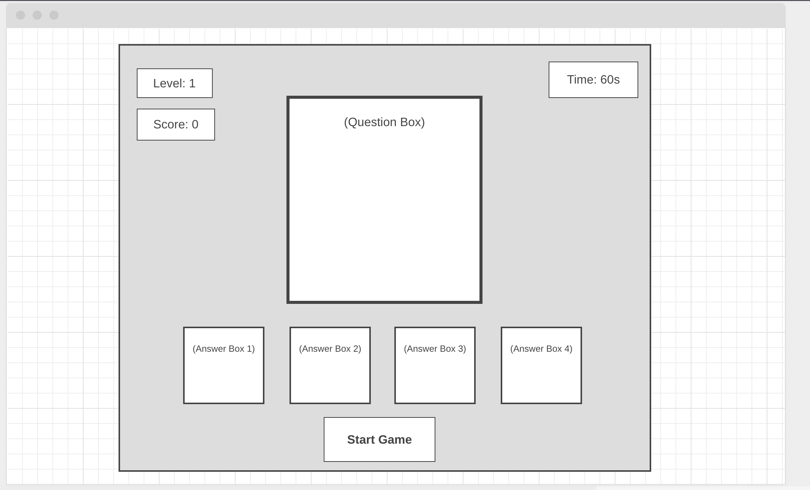
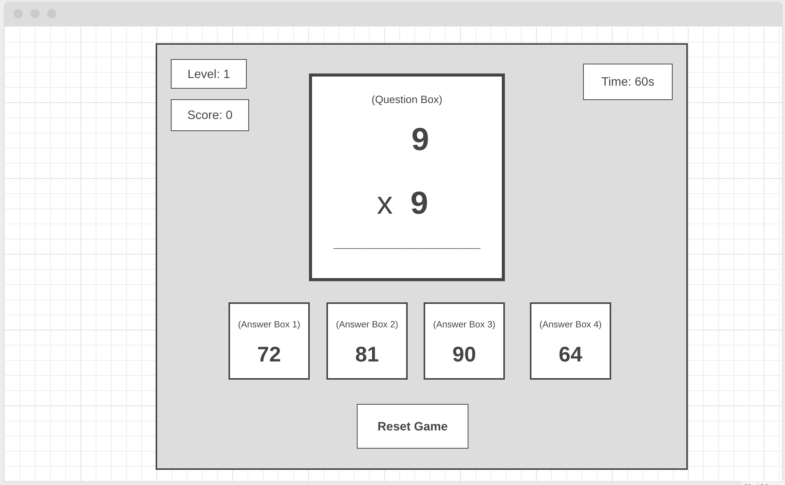
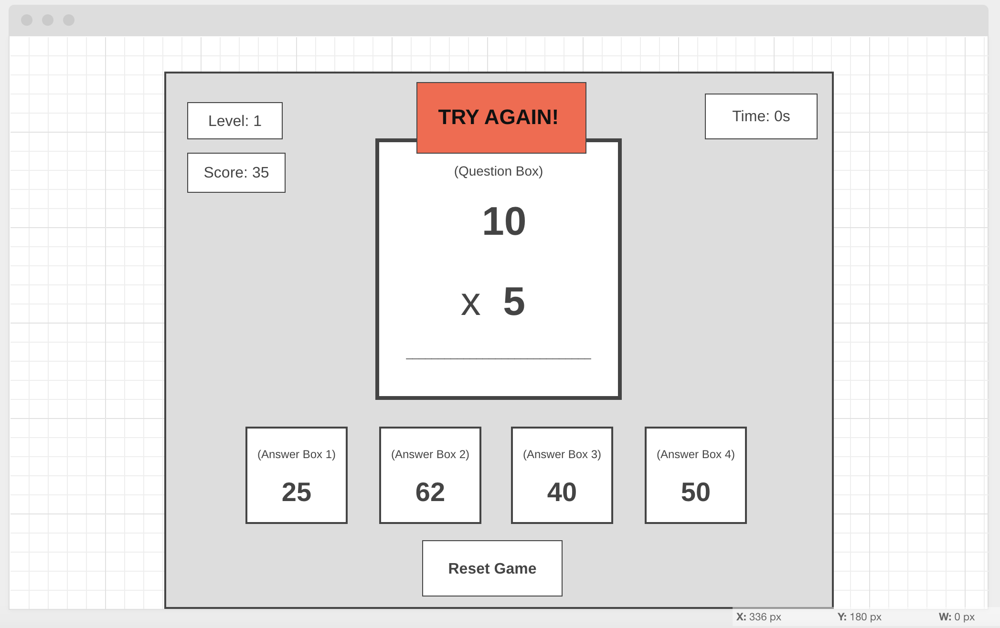
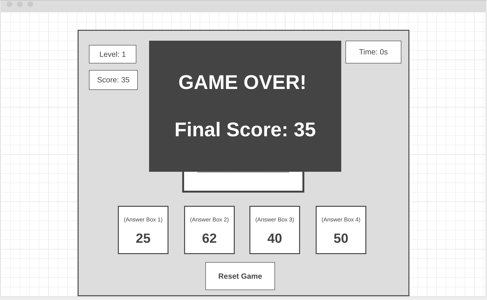

# Multiplication Game

This is a game built to test your multiplication skills! 

Once the game begins, two randomly generated numbers will appear in the question box and four randomly generated numbers will populate each of the answer boxes. One of the answer boxes will contain the correct answer and every time a new question is populated the correct answer will appear in a randomly selected answer box. Each time the player selects the correct answer their score will increase by 1 and a new question will appear. If the player selects an incorrect answer, a "Try Again" message will appear and the player's score will decrease by 1. The player has the opportunity to choose again on this same question until they select the right answer, but each time they continue to click on an incorrect answer their score will decrease by 1. The player's goal is to answer as many questions correctly as they can in the alotted time given to them each on each level. Level 1 is 40 seconds, level 2 is 20 seconds, and level 3 is 10 seconds. Once the timer hits 0 at the end of level 3, a "Game Over" message will appear with the player's final score. The player will have the option to start a new game. 

[Try it live](https://reverent-kare-d49434.netlify.app/)


## Motivation
As a kid, I always loved taking timed multiplication (times tables) quizes and tests in school. I was motivated to build this game as a way to continue to test my simple arithmetic skills.


## Screenshots










## User Stories & Wireframes

- The initial page will show an empty question box, 4 empty answer boxes, and a "Start Game" button.
- Once the "Start Game" button is clicked, the score box, time box, and level box will all populate on the screen. The initial score will be 0, level is 1, and the timer will start counting down from 40 seconds. (20 seconds on level 2 and 10 seconds on level 3).
- Additionally, two randomized numbers (between 1 - 12) will appear in the question box (num1 * num2) and 4 randomly generated numbers will appear in each of the 4 answer boxes. 1 of these 4 random numbers in the answer boxes will be the correct answer.
- As soon as the player initiates the game, the “Start Game” button will change to a "skip question" button, which will allow the player to generate a new question and four new answer choices. 
- If the player selects the correct answer, their score will increase by +1 and a new question will appear along with new numbers in each of the answer boxes. 
- Each time a new question is asked the position of the correct answer will be randomized. 
- If the player selects the incorrect answer a “TRY AGAIN” window will pop up on the page, and they player has the ability to choose again until they do select the correct answer.
- However, each time the player selects the incorrect ansswer, their score will decrease by 1.
- The player will have 40 seconds to answer as many questions as they can correctly on level 1. Level 2 will be 20 seconds and level 3 will be 10 seconds. 
- When the timer reaches 0 on levels 1 & 2, a "Time's Up! Next Level!" message will appear on the screen.
- At this stage, the "Skip Question" button will have been replaced with a "Next Level" button, which will take the player to the next level (level++)
- At the end of the 10 seconds at level 3, a “Game Over” message with the player's overall cumulative score will appear on the page. 
- At the game over stage of the game, The "Next Level" button will then become a "Start New Game" button and the player will have the option to initiate a new game. 


### Technologies & Code Snippets
A particular portion of my code that I am pround of is my random question and and answers generator. This particular section was challenging for me to populate the correct answer in a random square each new question/ answer is generated. 

```

function newQA() {
    nextLevelBtn.style.display = 'none'
    skipQuestionBtn.style.display = 'block'
    skipQuestionBtn.addEventListener('click', skipQuestion)
    addAnswerBtn()

    let num1 = Math.floor(1 + Math.random() * 12)
    let num2 = Math.floor(1 + Math.random() * 12)
    correctAnswer = num1 * num2
    document.querySelector('.question-box').innerHTML = `${num1} x ${num2}`
    let correctAnswerBox = (1 + Math.floor(Math.random() * 4))
    document.getElementById('box' + `${correctAnswerBox}`).innerHTML = correctAnswer

    for (i = 1; i < 5; i++) {
        if (i !== correctAnswerBox) {
            wrongAnswer = (1 + Math.floor(Math.random() * 12)) * (1 + Math.floor(Math.random() * 12))
            if (wrongAnswer !== correctAnswer) {
                document.getElementById('box' + `${i}`).innerHTML = wrongAnswer
            }
        }
    }
}

```

## Future Developments
For future developements on this game, I would like to add to the levels. My goal is to add to the random number generator functionality and add additional challenges to each of the levels. Eventually, my idea is to have Level 1 generating 2 single digit numbers, level 2 generating 1 single digit number and 1 double digit number, and finally having 2 double digit numbers in level 3. Additional levels after level 3 can increase by 10s. (20, 30, 40, etc). 

As I continue to add to the insentiy of each level, I want to change the point scoring functionality as well. As the challenge of each level increases, the points will increase as well. 


### Credits

**Font Styling**
[https://fonts.google.com/specimen/Fjalla+One?preview.text=9%20x%209&preview.text_type=custom&sidebar.open=true&selection.family=Fjalla+One]

**CSS Cursor styling**
[https://www.w3schools.com/cssref/pr_class_cursor.asp]

[https://www.w3schools.com/cssref/sel_active.asp]

**CSS Color Schemes**
[https://www.schemecolor.com/milky-way.php]
[https://www.w3schools.com/w3css/w3css_color_schemes.asp]

**CSS Media Queries**
[https://www.w3schools.com/cssref/css3_pr_mediaquery.asp]

**Fabicon Icon**
[https://www.favicon-generator.org/]


## Visit the site live here: 
[https://pages.git.generalassemb.ly/kelseywhallon/project1/]


